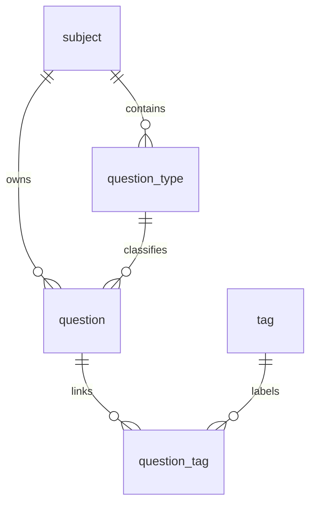

# 数据库说明

ViaTrial 使用 SQLite 作为本地数据库。默认数据文件为项目根目录下的 `data/viatrial.db`，该文件由 `.gitignore` 忽略，不应提交到 Git。

## 初始化方式

启动后端时，`DatabaseInitializer` 会确保 `data` 目录存在，并执行 `backend/src/main/resources/schema.sql` 中的建表语句。`backend/src/main/resources/sql/init.sql` 当前与 `schema.sql` 内容一致，可作为初始化脚本备份。

## 表关系



## subject

科目表。

| 字段 | 类型 | 约束 | 说明 |
| --- | --- | --- | --- |
| `id` | INTEGER | PRIMARY KEY AUTOINCREMENT | 科目 ID |
| `name` | TEXT | NOT NULL, UNIQUE | 科目名称 |
| `created_time` | DATETIME | NOT NULL, DEFAULT CURRENT_TIMESTAMP | 创建时间 |
| `updated_time` | DATETIME | NOT NULL, DEFAULT CURRENT_TIMESTAMP | 更新时间 |

## question_type

题型表，归属于科目。

| 字段 | 类型 | 约束 | 说明 |
| --- | --- | --- | --- |
| `id` | INTEGER | PRIMARY KEY AUTOINCREMENT | 题型 ID |
| `subject_id` | INTEGER | NOT NULL, FK | 所属科目 ID |
| `name` | TEXT | NOT NULL | 题型名称 |
| `created_time` | DATETIME | NOT NULL, DEFAULT CURRENT_TIMESTAMP | 创建时间 |
| `updated_time` | DATETIME | NOT NULL, DEFAULT CURRENT_TIMESTAMP | 更新时间 |

唯一约束：`UNIQUE(subject_id, name)`。

外键：`subject_id` 引用 `subject(id)`，删除时 `RESTRICT`，更新时 `CASCADE`。

索引：`idx_question_type_subject_id`。

## tag

标签表。

| 字段 | 类型 | 约束 | 说明 |
| --- | --- | --- | --- |
| `id` | INTEGER | PRIMARY KEY AUTOINCREMENT | 标签 ID |
| `name` | TEXT | NOT NULL, UNIQUE | 标签名称 |
| `created_time` | DATETIME | NOT NULL, DEFAULT CURRENT_TIMESTAMP | 创建时间 |
| `updated_time` | DATETIME | NOT NULL, DEFAULT CURRENT_TIMESTAMP | 更新时间 |

## question

题目表。

| 字段 | 类型 | 约束 | 说明 |
| --- | --- | --- | --- |
| `id` | INTEGER | PRIMARY KEY AUTOINCREMENT | 题目 ID |
| `subject_id` | INTEGER | NOT NULL, FK | 科目 ID |
| `type_id` | INTEGER | NOT NULL, FK | 题型 ID |
| `content` | TEXT | NOT NULL | 题目正文 |
| `answer` | TEXT | 可空 | 参考答案 |
| `analysis` | TEXT | 可空 | 解析 |
| `image_url` | TEXT | 可空 | 题目图片 URL |
| `answer_image_url` | TEXT | 可空 | 答案图片 URL |
| `difficulty` | INTEGER | NOT NULL, DEFAULT 1, CHECK | 难度，取值 1、2、3 |
| `created_time` | DATETIME | NOT NULL, DEFAULT CURRENT_TIMESTAMP | 创建时间 |
| `updated_time` | DATETIME | NOT NULL, DEFAULT CURRENT_TIMESTAMP | 更新时间 |

外键：

- `subject_id` 引用 `subject(id)`，删除时 `RESTRICT`，更新时 `CASCADE`。
- `type_id` 引用 `question_type(id)`，删除时 `RESTRICT`，更新时 `CASCADE`。

索引：

- `idx_question_subject_id`
- `idx_question_type_id`
- `idx_question_created_time`

## question_tag

题目和标签关联表。

| 字段 | 类型 | 约束 | 说明 |
| --- | --- | --- | --- |
| `id` | INTEGER | PRIMARY KEY AUTOINCREMENT | 关联 ID |
| `question_id` | INTEGER | NOT NULL, FK | 题目 ID |
| `tag_id` | INTEGER | NOT NULL, FK | 标签 ID |
| `created_time` | DATETIME | NOT NULL, DEFAULT CURRENT_TIMESTAMP | 创建时间 |

唯一约束：`UNIQUE(question_id, tag_id)`。

外键：

- `question_id` 引用 `question(id)`，删除时 `CASCADE`，更新时 `CASCADE`。
- `tag_id` 引用 `tag(id)`，删除时 `RESTRICT`，更新时 `CASCADE`。

索引：

- `idx_question_tag_question_id`
- `idx_question_tag_tag_id`

## 备份与恢复

备份前先停止后端进程，然后复制：

```text
data/viatrial.db
```

恢复时同样先停止后端，再用备份文件替换 `data/viatrial.db`。
