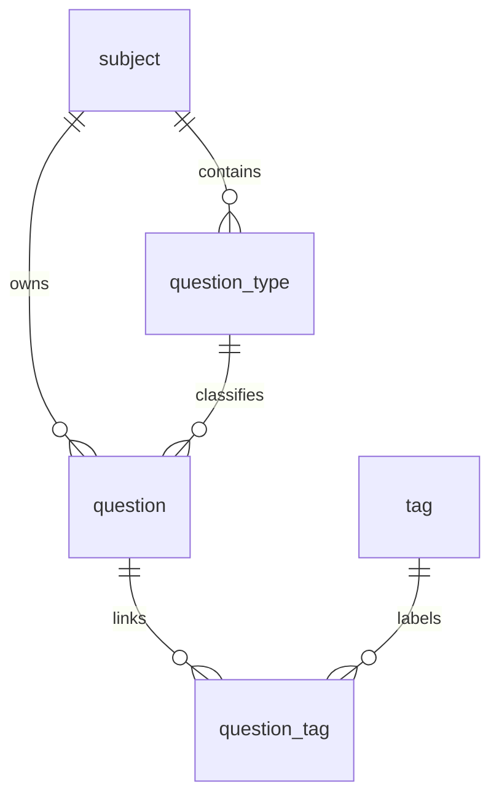

# 数据库说明

ViaTrial 使用 SQLite 作为本地数据库。数据文件位置由 `viatrial.data-dir` 决定（默认 `data`），启动时解析为**绝对路径**，默认落在 `<启动工作目录>/data/viatrial.db`。该文件由 `.gitignore` 忽略，不应提交到 Git。

> **注意**：数据目录解析为绝对路径是为了消除“同一份代码在不同工作目录下启动会创建两个库”的历史问题。仓库根目录启动（`start.bat`）得到 `<repo>/data/viatrial.db`；从 `backend/` 启动（IDE、`mvn spring-boot:run`）得到 `<repo>/backend/data/viatrial.db`。如需固定位置，显式配置绝对路径：
>
> ```bash
> java -jar viatrial-backend-0.3.1.jar --viatrial.data-dir=D:/ViaTrialData
> ```
>
> 可用环境变量 `VIATRIAL__DATA_DIR` 覆盖。

## 初始化与迁移

初始化由 `com.viatrial.database.DatabaseInitializer` 在启动时执行，分两步：

1. **建表基线**：执行 `backend/src/main/resources/schema.sql`（唯一真相源），由 Spring `ScriptUtils` 解析，支持注释与语句内分号。
2. **版本化迁移**：`SchemaMigrationRunner` 按版本号顺序执行 `backend/src/main/resources/db/migration/V<n>__*.sql`，并在 `schema_version` 表中记录已应用版本。

新增结构变更请**新增**一个迁移文件，不要修改基线中已被历史库执行过的语句语义。迁移脚本必须幂等（`IF EXISTS` / `IF NOT EXISTS`），因为历史库与新建库都会执行它。

```sql
-- 示例：backend/src/main/resources/db/migration/V4__add_xxx.sql
ALTER TABLE question ADD COLUMN xxx TEXT;
```

外键开关是 SQLite 的连接级设置且默认关闭，连接池通过 `connection-init-sql: PRAGMA foreign_keys=ON` 对每个连接显式开启，`DataSecurityTest` 会断言该不变量。

## 表关系



## subject

科目表。

| 字段 | 类型 | 约束 | 说明 |
| --- | --- | --- | --- |
| `id` | INTEGER | PRIMARY KEY AUTOINCREMENT | 科目 ID |
| `name` | TEXT | NOT NULL, UNIQUE | 科目名称 |
| `created_time` | DATETIME | NOT NULL, DEFAULT CURRENT_TIMESTAMP | 创建时间 |
| `updated_time` | DATETIME | NOT NULL, DEFAULT CURRENT_TIMESTAMP | 更新时间 |

## question_type

题型表，归属于科目。

| 字段 | 类型 | 约束 | 说明 |
| --- | --- | --- | --- |
| `id` | INTEGER | PRIMARY KEY AUTOINCREMENT | 题型 ID |
| `subject_id` | INTEGER | NOT NULL, FK | 所属科目 ID |
| `name` | TEXT | NOT NULL | 题型名称 |
| `created_time` | DATETIME | NOT NULL, DEFAULT CURRENT_TIMESTAMP | 创建时间 |
| `updated_time` | DATETIME | NOT NULL, DEFAULT CURRENT_TIMESTAMP | 更新时间 |

唯一约束：`UNIQUE(subject_id, name)`。

外键：`subject_id` 引用 `subject(id)`，删除时 `RESTRICT`，更新时 `CASCADE`。

索引：无显式单列索引（`UNIQUE(subject_id, name)` 的隐式索引已覆盖 `subject_id` 前缀查询）。

## tag

标签表。

| 字段 | 类型 | 约束 | 说明 |
| --- | --- | --- | --- |
| `id` | INTEGER | PRIMARY KEY AUTOINCREMENT | 标签 ID |
| `name` | TEXT | NOT NULL, UNIQUE | 标签名称 |
| `created_time` | DATETIME | NOT NULL, DEFAULT CURRENT_TIMESTAMP | 创建时间 |
| `updated_time` | DATETIME | NOT NULL, DEFAULT CURRENT_TIMESTAMP | 更新时间 |

## question

题目表。

| 字段 | 类型 | 约束 | 说明 |
| --- | --- | --- | --- |
| `id` | INTEGER | PRIMARY KEY AUTOINCREMENT | 题目 ID |
| `subject_id` | INTEGER | NOT NULL, FK | 科目 ID |
| `type_id` | INTEGER | NOT NULL, FK | 题型 ID |
| `content` | TEXT | NOT NULL | 题目正文 |
| `answer` | TEXT | 可空 | 参考答案 |
| `analysis` | TEXT | 可空 | 解析 |
| `image_url` | TEXT | 可空 | 题目图片 URL |
| `answer_image_url` | TEXT | 可空 | 答案图片 URL |
| `difficulty` | INTEGER | NOT NULL, DEFAULT 1, CHECK | 难度，取值 1、2、3 |
| `created_time` | DATETIME | NOT NULL, DEFAULT CURRENT_TIMESTAMP | 创建时间 |
| `updated_time` | DATETIME | NOT NULL, DEFAULT CURRENT_TIMESTAMP | 更新时间 |

外键：

- `subject_id` 引用 `subject(id)`，删除时 `RESTRICT`，更新时 `CASCADE`。
- `type_id` 引用 `question_type(id)`，删除时 `RESTRICT`，更新时 `CASCADE`。

索引：

- `idx_question_subject_id`
- `idx_question_type_id`
- `idx_question_subject_type`（组卷/统计按 `subject_id + type_id` 过滤的热路径）
- `idx_question_created_time`

## question_tag

题目和标签关联表。

| 字段 | 类型 | 约束 | 说明 |
| --- | --- | --- | --- |
| `id` | INTEGER | PRIMARY KEY AUTOINCREMENT | 关联 ID |
| `question_id` | INTEGER | NOT NULL, FK | 题目 ID |
| `tag_id` | INTEGER | NOT NULL, FK | 标签 ID |
| `created_time` | DATETIME | NOT NULL, DEFAULT CURRENT_TIMESTAMP | 创建时间 |

唯一约束：`UNIQUE(question_id, tag_id)`。

外键：

- `question_id` 引用 `question(id)`，删除时 `CASCADE`，更新时 `CASCADE`。
- `tag_id` 引用 `tag(id)`，删除时 `RESTRICT`，更新时 `CASCADE`。

索引：

- `idx_question_tag_tag_id`（`question_id` 由 `UNIQUE(question_id, tag_id)` 的隐式索引覆盖）

## 备份与恢复

备份前先停止后端进程，然后复制数据目录中的数据库文件（含 `-wal`/`-shm` 伴生文件，如存在）：

```text
data/viatrial.db
```

恢复时同样先停止后端，再用备份文件替换 `data/viatrial.db`。若使用了自定义 `viatrial.data-dir`，请相应替换目录。

数据目录中的 `.write-token` 是写接口访问令牌，**不要**随备份分发；恢复后如需轮换，删除该文件重启即可重新生成。
